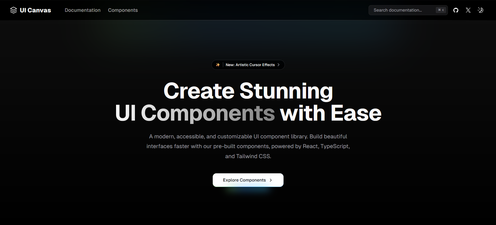

## Artifact UI

Artifact UI is a component library that provides a modern and accessible design system for building beautiful and performant web applications.

## Documentation

Visit https://artifact-ui.vercel.app/docs to view the documentation.

## Contributing

Please read the [contributing guide](/CONTRIBUTING.md).
